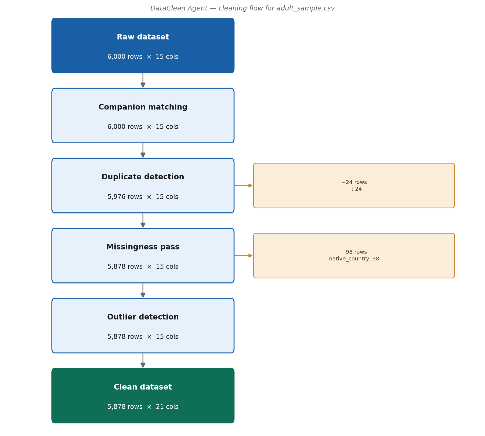

# Cleaning Audit Report

**Dataset:** adult_sample.csv  
**Session:** 20260530-062547-f0fd71  
**Generated:** 2026-05-30 06:25 UTC  

---

## Summary

| Metric | Value |
| --- | --- |
| Rows (in → out) | 6,000 → 5,878 |
| Columns (in → out) | 15 → 21 |
| Total decisions logged | 38 |
| Automated (mechanical) | 22 |
| Human-confirmed / default | 16 |
| Analyst overrides | 0 |

## Cleaning Flowchart

## What Changed

### Format resolution

6 column name(s) standardised; 6 column(s) re-typed to their correct data type; 3 column(s) had placeholder tokens (e.g. '?') converted to missing; 10 other mechanical fix(es) applied.

### Duplicate detection

24 duplicate row(s) removed.

### Missingness

98 rows removed; 2 variable(s) imputed or flagged.

- workclass: 365 missing (6.1%) — Fill the gaps with the most common value
- occupation: 367 missing (6.1%) — Fill the gaps with the most common value
- native_country: 98 missing (1.6%) — Delete the rows with a missing value

### Outlier detection

No flagged outliers acted on.

- age: 29 value(s) flagged — Keep these values — they are valid
- fnlwgt: 154 value(s) flagged — Leave for now — needs a closer look
- education_num: 217 value(s) flagged — Keep these values — they are valid
- capital_gain: 469 value(s) flagged — Leave for now — needs a closer look
- capital_loss: 293 value(s) flagged — Leave for now — needs a closer look
- hours_per_week: 1,634 value(s) flagged — Keep these values — they are valid

### Feature engineering

6 transformation(s) applied.

- capital_gain: Bin into quantile groups → `capital_gain_bin`
- capital_loss: Bin into quantile groups → `capital_loss_bin`
- fnlwgt: Robust-scale (median / IQR) → `fnlwgt_scaled`
- capital_gain: Log-transform (log1p) → `capital_gain_scaled`
- capital_loss: Log-transform (log1p) → `capital_loss_scaled`
- native_country: Frequency encode → `native_country_freq`

## Variable Summary

| Variable | Type | Missingness | What happened |
| --- | --- | --- | --- |
| age | integer | 0.0% | Re-typed; Keep these values — they are valid |
| workclass | categorical | 6.1% → 0.0% | Trimmed; Converted; Fill the gaps with the most common value |
| fnlwgt | integer | 0.0% | Re-typed; Leave for now — needs a closer look; Robust-scale (median / IQR) |
| education | categorical | 0.0% | Trimmed |
| education-num → education_num | integer | 0.0% | renamed; Re-typed; Keep these values — they are valid |
| marital-status → marital_status | categorical | 0.0% | renamed; Trimmed |
| occupation | categorical | 6.1% → 0.0% | Trimmed; Converted; Fill the gaps with the most common value |
| relationship | categorical | 0.0% | Trimmed |
| race | categorical | 0.0% | Trimmed |
| sex | categorical | 0.0% | Trimmed |
| capital-gain → capital_gain | integer | 0.0% | renamed; Re-typed; Leave for now — needs a closer look; Bin into quantile groups; Log-transform (log1p) |
| capital-loss → capital_loss | integer | 0.0% | renamed; Re-typed; Leave for now — needs a closer look; Bin into quantile groups; Log-transform (log1p) |
| hours-per-week → hours_per_week | integer | 0.0% | renamed; Re-typed; Keep these values — they are valid |
| native-country → native_country | categorical | 1.6% → 0.0% | renamed; Trimmed; Converted; Delete the rows with a missing value; Frequency encode |
| income | categorical | 0.0% | Trimmed |
| capital_gain_bin | categorical | 0.0% | derived (new column) |
| capital_loss_bin | categorical | 0.0% | derived (new column) |
| fnlwgt_scaled | numeric | 0.0% | derived (new column) |
| capital_gain_scaled | numeric | 0.0% | derived (new column) |
| capital_loss_scaled | numeric | 0.0% | derived (new column) |
| native_country_freq | numeric | 0.0% | derived (new column) |

## Final Dataset Profile

Summary statistics for every variable in the cleaned dataset.

### `age`

**Type:** integer  |  **Missing:** 0.0% (0 of 5,878)  |  **Unique values:** 69

| Mean | Median | Std | Min | Max | Q25 | Q75 |
| --- | --- | --- | --- | --- | --- | --- |
| 38.77 | 37.00 | 13.76 | 17.00 | 90.00 | 28.00 | 48.00 |

### `workclass`

**Type:** categorical  |  **Missing:** 0.0% (0 of 5,878)  |  **Unique values:** 8

| Value | Count |
| --- | --- |
| Private | 4,441 |
| Self-emp-not-inc | 471 |
| Local-gov | 395 |
| State-gov | 208 |
| Self-emp-inc | 193 |

### `fnlwgt`

**Type:** integer  |  **Missing:** 0.0% (0 of 5,878)  |  **Unique values:** 5,309

| Mean | Median | Std | Min | Max | Q25 | Q75 |
| --- | --- | --- | --- | --- | --- | --- |
| 188,069 | 176,982 | 103,957 | 14,878 | 1,455,435 | 117,008 | 237,617 |

### `education`

**Type:** categorical  |  **Missing:** 0.0% (0 of 5,878)  |  **Unique values:** 16

| Value | Count |
| --- | --- |
| HS-grad | 1,949 |
| Some-college | 1,358 |
| Bachelors | 964 |
| Masters | 282 |
| Assoc-voc | 237 |

### `education_num`

**Type:** integer  |  **Missing:** 0.0% (0 of 5,878)  |  **Unique values:** 16

| Mean | Median | Std | Min | Max | Q25 | Q75 |
| --- | --- | --- | --- | --- | --- | --- |
| 10.02 | 10.00 | 2.54 | 1.00 | 16.00 | 9.00 | 12.00 |

### `marital_status`

**Type:** categorical  |  **Missing:** 0.0% (0 of 5,878)  |  **Unique values:** 7

| Value | Count |
| --- | --- |
| Married-civ-spouse | 2,692 |
| Never-married | 1,915 |
| Divorced | 804 |
| Widowed | 203 |
| Separated | 193 |

### `occupation`

**Type:** categorical  |  **Missing:** 0.0% (0 of 5,878)  |  **Unique values:** 14

| Value | Count |
| --- | --- |
| Craft-repair | 1,122 |
| Exec-managerial | 736 |
| Prof-specialty | 709 |
| Adm-clerical | 679 |
| Sales | 661 |

### `relationship`

**Type:** categorical  |  **Missing:** 0.0% (0 of 5,878)  |  **Unique values:** 6

| Value | Count |
| --- | --- |
| Husband | 2,374 |
| Not-in-family | 1,547 |
| Own-child | 886 |
| Unmarried | 628 |
| Wife | 275 |

### `race`

**Type:** categorical  |  **Missing:** 0.0% (0 of 5,878)  |  **Unique values:** 5

| Value | Count |
| --- | --- |
| White | 5,045 |
| Black | 573 |
| Asian-Pac-Islander | 164 |
| Amer-Indian-Eskimo | 51 |
| Other | 45 |

### `sex`

**Type:** categorical  |  **Missing:** 0.0% (0 of 5,878)  |  **Unique values:** 2

| Value | Count |
| --- | --- |
| Male | 3,898 |
| Female | 1,980 |

### `capital_gain`

**Type:** integer  |  **Missing:** 0.0% (0 of 5,878)  |  **Unique values:** 85

| Mean | Median | Std | Min | Max | Q25 | Q75 |
| --- | --- | --- | --- | --- | --- | --- |
| 989.32 | 0.0000 | 7,038 | 0.0000 | 99,999 | 0.0000 | 0.0000 |

### `capital_loss`

**Type:** integer  |  **Missing:** 0.0% (0 of 5,878)  |  **Unique values:** 64

| Mean | Median | Std | Min | Max | Q25 | Q75 |
| --- | --- | --- | --- | --- | --- | --- |
| 92.70 | 0.0000 | 413.54 | 0.0000 | 3,900 | 0.0000 | 0.0000 |

### `hours_per_week`

**Type:** integer  |  **Missing:** 0.0% (0 of 5,878)  |  **Unique values:** 79

| Mean | Median | Std | Min | Max | Q25 | Q75 |
| --- | --- | --- | --- | --- | --- | --- |
| 40.46 | 40.00 | 12.35 | 1.00 | 99.00 | 40.00 | 45.00 |

### `native_country`

**Type:** categorical  |  **Missing:** 0.0% (0 of 5,878)  |  **Unique values:** 40

| Value | Count |
| --- | --- |
| United-States | 5,386 |
| Mexico | 103 |
| Philippines | 35 |
| Canada | 26 |
| Cuba | 24 |

### `income`

**Type:** categorical  |  **Missing:** 0.0% (0 of 5,878)  |  **Unique values:** 2

| Value | Count |
| --- | --- |
| <=50K | 4,482 |
| >50K | 1,396 |

### `capital_gain_bin`

**Type:** categorical  |  **Missing:** 0.0% (0 of 5,878)  |  **Unique values:** 1

| Value | Count |
| --- | --- |
| all | 5,878 |

### `capital_loss_bin`

**Type:** categorical  |  **Missing:** 0.0% (0 of 5,878)  |  **Unique values:** 1

| Value | Count |
| --- | --- |
| all | 5,878 |

### `fnlwgt_scaled`

**Type:** numeric  |  **Missing:** 0.0% (0 of 5,878)  |  **Unique values:** 5,309

| Mean | Median | Std | Min | Max | Q25 | Q75 |
| --- | --- | --- | --- | --- | --- | --- |
| 0.0919 | 0.0000 | 0.8619 | -1.34 | 10.60 | -0.4973 | 0.5027 |

### `capital_gain_scaled`

**Type:** numeric  |  **Missing:** 0.0% (0 of 5,878)  |  **Unique values:** 85

| Mean | Median | Std | Min | Max | Q25 | Q75 |
| --- | --- | --- | --- | --- | --- | --- |
| 0.7008 | 0.0000 | 2.40 | 0.0000 | 11.51 | 0.0000 | 0.0000 |

### `capital_loss_scaled`

**Type:** numeric  |  **Missing:** 0.0% (0 of 5,878)  |  **Unique values:** 64

| Mean | Median | Std | Min | Max | Q25 | Q75 |
| --- | --- | --- | --- | --- | --- | --- |
| 0.3740 | 0.0000 | 1.63 | 0.0000 | 8.27 | 0.0000 | 0.0000 |

### `native_country_freq`

**Type:** numeric  |  **Missing:** 0.0% (0 of 5,878)  |  **Unique values:** 24

| Mean | Median | Std | Min | Max | Q25 | Q75 |
| --- | --- | --- | --- | --- | --- | --- |
| 0.8401 | 0.9163 | 0.2522 | 0.0002 | 0.9163 | 0.9163 | 0.9163 |

## Methods

The dataset `adult_sample.csv` entered the pipeline with 6,000 rows and 15 variables. 122 rows were removed during cleaning, leaving 5,878 rows and 21 variables. Of 38 logged decisions, 22 were applied automatically and 16 required a judgment call. Every decision — automated or human — is captured in the accompanying `decisions.json`, and `clean_script.py` replays the entire process from the raw input.

---

*Generated by DataClean Agent. Every transformation above is reproducible from the accompanying `clean_script.py`.*
